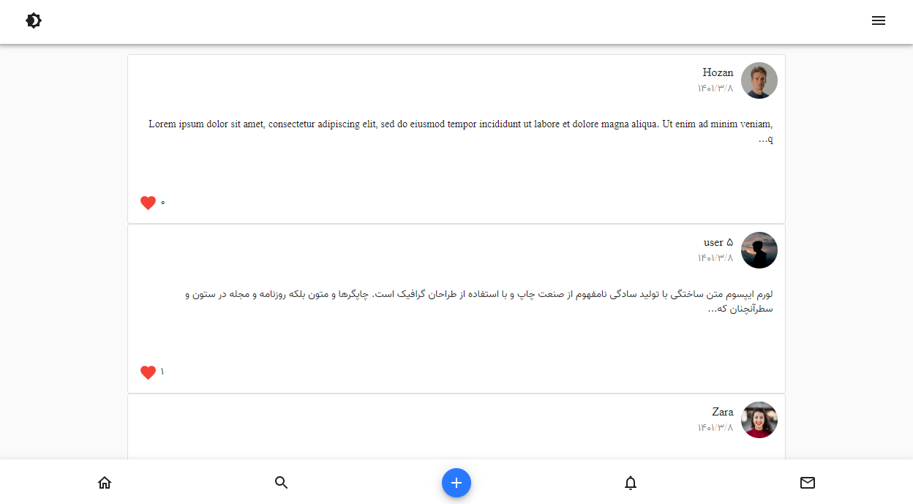
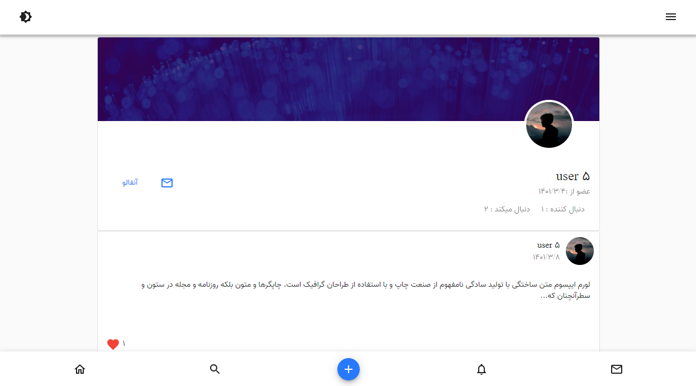

# Social Media web app

Created with Django djoser redis / React Redux material-ui

[Live Demo](https://profileapp.pythonanywhere.com/)

<br/>
<p align="center">

</p>
<br/>
<br/>
<p align="center">

</p>
<br/>

# Installation

`virtualenv venv`

`pip install django`

# For Mac/ Linux

`source venv/bin/activate`

# For Window

`venv/Scripts/activate`

`pip install -r requirements.txt`

`python manage.py makemigrations`

`python manage.py migrate`

`python manage.py runserver`

# For Admin Login

```python
python manage.py createsuperuser
Username : admin
Password : 12345678
```

# Front end

`cd frontend`

`npm install`

`npm start`

`npm run build`
